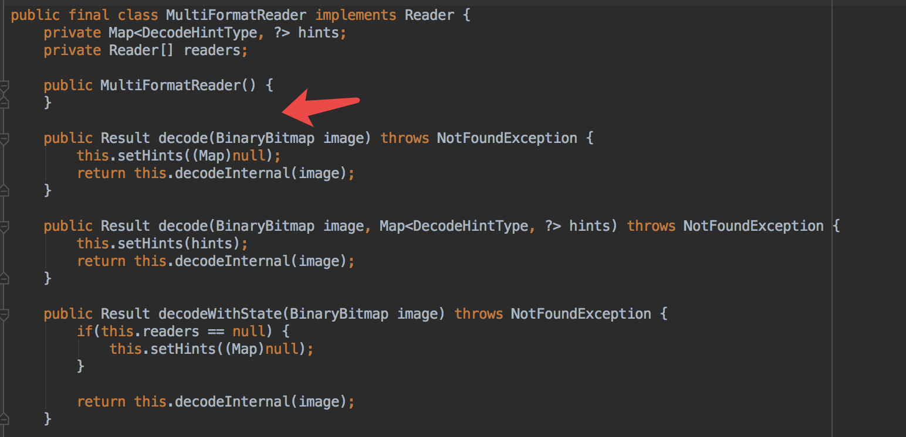
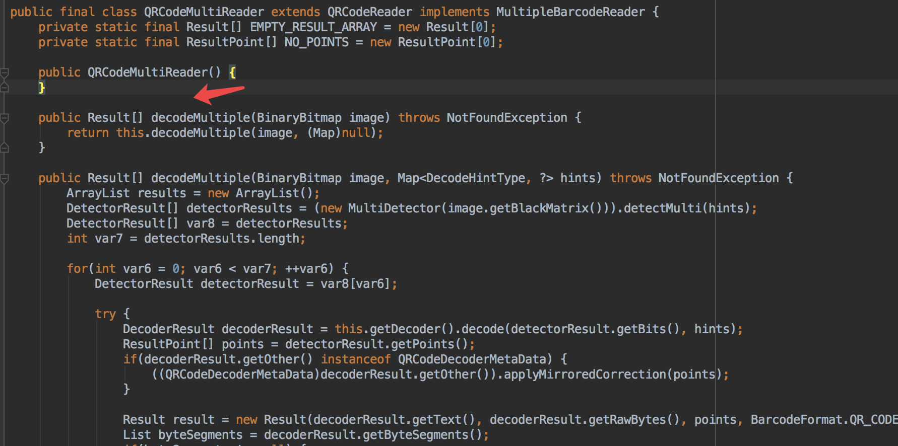

### 使用ZXing扫描多个二维码，条形码

#### 通常情况下，我们在扫描二维码的时候是一个一个去扫的，那么能不能一次扫描多个二维码，一下解析所有结果呢？答案是有的，其实ZXing是给我们提供方法了。但是可惜的是，扫描条形码的时候，ZXing并没有给我们提供这样的方法，这就需要另想其他办法了

#### 先理一下，ZXing框架扫描解码的大致过程：

  * 从摄像头拿数据，byte[] data
  * 对数据进行解析，这里需要注意的是，ZXing提供了两个解析类，分别为`MultiFormatReader`跟`QRCodeMultiReader`

> 其中MultiFormatReader能解析二维码、条形码。而QRCodeMultiReader只能解析二维码。大多数代码使用的是MultiFormatReader这个类，因为二维码、条形码都能扫描，很方便。但是有个问题就是`MultiFormatReader`并没有提供解析多个结果的方法，也就意味着如果用这个解析类是无法直接得到解析多个二维码结果的。我截了两张图，如下：

  

#### 可以看到，如果想一次扫描并解析多个二维码，用QRCodeMultiReader这个类就可以了，可以返回Result[]，同时，对CaptureActivityHandler中的`public void handleMessage(Message message)`方法进行相应的修改,最终会在`CaptureActivity`中将结果集回调到我们调用ZXing扫描的地方。 这个解析类是出现在`DecodeHandler` 中的，将其中的解析类改成QRCodeMultiReader，并将下面的`private void decode(byte[] data, int width, int height)`方法做修改，让它返回解析多个结果。下面我会附上源码

#### ok，扫描多个二维码已经实现了，但是扫描多个条形码怎么实现呢？想过一下思路：

  * 想过能不能用图像识别技术，就是扫描之后，通过jni调用opencv能不能将多个条形码分离出来，然后逐个解析
  * 扫描的时候会截图扫描框里的图片，然后会识别这个条形码，那么这个图片就是有宽高的矩形，可以让程序一直扫描一直扫描，先扫描到第一张条形码，然后获取这个条形码的宽高，用白色填充这个矩形。然后一直重复这个动作，直到所有的条形码都扫出来为止

> 第二个思路是挖财公司的一个大佬给我提供的，打算在下一篇博客中去实现它。如果有其他思路或者代码，也可以分享一下。

